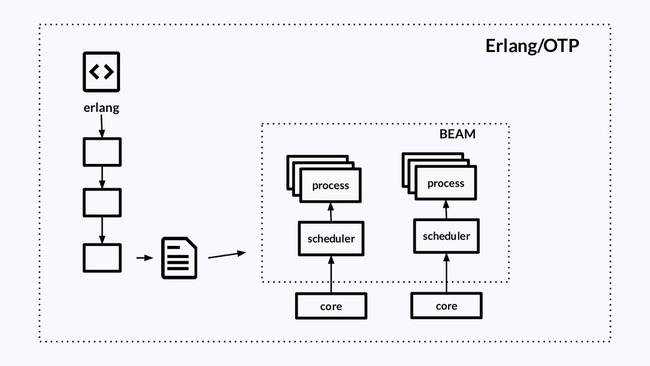

Sobre mim
---


Olá! Eu sou Zoey Pessanha, uma entusiasta de Elixir e engenheira de software com uma paixão ardente pela programação funcional e desenvolvimento web. Meu foco principal é a linguagem Elixir e o framework Phoenix, e estou animada para compartilhar meu conhecimento e experiência com você neste workshop.

## Experiências

<!-- column_layout: [4, 3, 3, 3] -->

<!-- column: 0 -->


<!-- column: 1 -->


<!-- column: 2 -->


<!-- column: 3 -->


<!-- reset_layout -->

## Curiosidades

- gosto de cozinhar
- já disse que adoro programar?
- já vi uns anime estranho (puka, lain)
- adoro viajar e fazer mochilão

[GitHub: @zoedsoupe](https://github.com/zoedsoupe) | [LinkedIn: Zoey Pessanha](https://linkedin.com/in/zoedsoupe)

<!-- end_slide -->

Introdução ao Elixir
---

- lang funcional
- alta concorrência
- tolerante a falhas
- sintaxe amigável
- é executada na máquina virtual do Erlang, a BEAM

## Como a BEAM funciona?

<!-- column_layout: [2, 10, 2] -->
<!-- column: 1 -->


<!-- end_slide -->

Introdução ao Elixir
---

### Supervisors

- controla e gerencia vários processos
- estratégia `:one_for_one`, `:one_for_all`, `:rest_for_one`

```elixir
defmodule MeuApp.Application do
  use Application

  def start_link(_start, _args) do
    children = [App1, App2, App3]
    options = [strategy: :one_for_one]
    Supervisor.star_link(children, opts)
  end
end
```

<!-- end_slide -->

Introdução ao Elixir
---

Todos os exemplos a seguir podem ser testados no REPL do Elixir: `iex`

## Números e Strings

```elixir
1 # inteiros
1.0 # float 64bits
100_000_000 # separador para casa decimais
0b101 # 5 em binário
0o777 # 511 em octal
0x2A # 42 em hexadecimal

"UMA STRING"
'UMA CADEIA DE CARACTERES'
~s(uma string) # mesmo que usar ""
```

## Variável

```elixir
a = 1
```

## Módulos e Funções

```elixir
defmodule Teste do
  def hello do
    IO.puts("Hello World")
  end

  defp private, do: IO.puts("Sou privada!")
end
```

<!-- end_slide -->

Introdução ao Elixir
---

## Listas e Tuplas

```elixir
[1, 2, 3] # lista homogênea
[1, "string", 42] # lista heterogênea
~w(foo bar) # lista de palavras ["foo", "bar"]

{1, 2} # tupla 2 elementos: par
{:ok, 42, "string"} # tupla 3 elementos: tripla
```

## Átomos e Mapas

```elixir
:zoey # átomo que seu valor é ele mesmo
:zoey == :zoey # true
true and false or nil # átomos especial

%{chave: "valor", :1 => 42, "chave" => :valor}
```

<!-- end_slide -->

Liquid API
---

Vamos construir uma API RESTful com Elixir/Phoenix que consiste num sistema bancário de transferências em tempo real.

## Mas o que é REST?

REST é uma arquitetura usada para construir APIs (application programming interface). E ser RESTful consiste em atender os requisitos que arquitetura **REST** propõe! Lembre-se que não é preciso implementar **REST** do zero pois esse já é o padrão utilziado em HTTP APIs.

> Outra arquitetura por exemplo seria GraphQL

## Métodos HTTP

Formas de se comunicar com um servidor/HTTP API.

| Metodo | Função  |
| ------ | ------- |
| GET | Recuperar recursos do servidor |
| POST | Enviar dados ao servidor |
| PUT | Atualizar recursos existentes do servidor |
| DELETE | Remover um recurso existente do servidor |

## Autenticação X Autorização

- Autenticação: permitir a entrada ou não de uma pessoa usuária no sistema
- Autorização: permitir o acesso a certas partes do sistema pela pessoa usuária

### Formas de Autenticação em APIs

- Basic authentication - via usuario:senha
- Bearer authentication - via token
- API keys - chaves específicas pra uso
- OAuth - senhas e tokens

<!-- end_slide -->

Liquid API
---

Estrutura do projeto:

<!-- column_layout: [2, 4] -->

<!-- column: 0 -->
- separado em contextos
- cada contexto é idependente dos outros
- cada contexto fornece uma API pública
- configuração específica para cada ambiente (prod, dev, test)

<!-- column: 1 -->
```sh
.
├── Dockerfile
├── Insomnia_2023-10-21.json
├── README.md
├── config
│   ├── config.exs
│   ├── dev.exs
│   ├── prod.exs
│   ├── runtime.exs
│   └── test.exs
├── docker-compose.yml
├── lib
│   ├── liquid
│   │   ├── accounts
│   │   ├── application.ex
│   │   ├── auth
│   │   ├── operations
│   │   ├── release.ex
│   │   └── repo.ex
│   ├── liquid_web
│   │   ├── controllers
│   │   ├── endpoint.ex
│   │   ├── router.ex
│   │   └── verify_header.ex
│   └── liquid_web.ex
├── mix.exs
├── mix.lock
├── priv
│   └── repo
│       └── migrations
├── rel
└── test
```

<!-- reset_layout -->

<!-- end_slide -->

Liquid Auth
---

<!-- column_layout: [2, 2, 2] -->

<!-- column: 1 -->
Vamos servir os seguintes endpoints:

- `POST` `/api/login`

<!-- reset_layout -->

<!-- column_layout: [3, 4] -->

<!-- column: 0 -->
E os seguintes modelos:

## User

| Campo | Tipo |
| ----- | ---- |
| id | UUID|
|CPF | string |
| first_name| string |
| last_name| string |
| inserted_at| dateTime |
| updated_at| dateTime|
| hash_password | string |
| password |string|

Primeiro vamos criar a migration com o comando `mix ecto.gen.migration create_user`

<!-- column: 1 -->
```elixir
defmodule Liquid.Repo.Migrations.CreateUser do
  use Ecto.Migration

  def change do
    create table(:user) do
      add :cpf, :string, null: false
      add :first_name, :string, null: false
      add :last_name, :string
      add :hash_senha, :string, null: false
      
      timestamps()
    end
  end
end
```

<!-- reset_layout -->

<!-- end_slide -->

Liquid Auth
---

<!-- column_layout: [5, 5] -->

<!-- column: 0 -->
Agora vamos criar o modelo, criando um arquivo `user.ex` dentro da pasta `liquid_auth/lib/liquid/auth/models`

```elixir
defmodule Liquid.Auth.Models.User do
  use Ecto.Schema # módudo que define DSL

  import Ecto.Changeset # módulo que define funções de validação

  @fields ~w[id first_name last_name cpf inserted_at updated_at]a

  @derive {Jason.Encoder, except: @fields}
  @primary_key {:id, Ecto.UUID, autogenerate: true}
  schema "user" do
    field :cpf, :string
    field :first_name, :string
    field :last_name, :string
    field :hash_password, :string
    field :password, :string, virtual: true

    timestamps()
  end
end
```

<!-- column: 1 -->
E tbm funções para manipular esse modelo:

```elixir
# ...
  def changeset(user \\ %__MODULE__{}, attrs) do
    user
    |> cast(attrs, ~w[cpf first_name last_name password]a)
    |> validate_required(~w[cpf first_name password]a)
    |> unique_constraint(:cpf)
    |> put_hash_senha()
  end

  defp put_hash_senha(%{valid?: false} = changeset), do: changeset

  defp put_hash_senha(changeset) do
    if password = get_change(changeset, :senha) do
      put_change(changeset, :hash_senha, Argon2.hash_pwd_salt(password))
    else
      changeset
    end
  end
# ...
```

<!-- reset_layout -->

<!-- end_slide -->

Liquid Auth
---

<!-- column_layout: [4, 4] -->

<!-- column: 0 -->
Agora vamos criar as funções para interagir com um `user`. No arquivo `liquid_auth/lib/liquid/auth.ex`:

```elixir
defmodule Liquid.Auth do
  alias Liquid.Auth.Models.User
  alias Liquid.Repo

  import Ecto.Query

  def register_user(attrs) do
    attrs |> User.register_changeset() |> Repo.insert()
  end

  def fetch_user(id) do
    query = from(u in User, select: u, where: u.id == ^id)

    if user = Repo.one(query) do
      {:ok, user}
    else
      {:error, :not_found}
    end
  end
end
```

<!-- column: 1 -->

```elixir
# ...
  def fetch_user_by_cpf_and_password(cpf, password) do
    query = from(u in User, select: u, where: u.cpf == ^cpf)
    maybe_user = Repo.one(query)

    if maybe_user &&
      Bcrypt.verify_pass(password, maybe_user.hash_password) do
      {:ok, maybe_user}
    else
      {:error, :invalid_credentials}
    end
  end

  def update_user(%User{} = user, attrs) do
    user |> User.update_changeset(attrs) |> Repo.update()
  end

  defdelegate delete_user(user), to: Repo, as: :delete
# ...
```

<!-- reset_layout -->

<!-- end_slide -->

Liquid Auth
---

Agora que temos como gerenciar um `User` e uma, vamos implementar o Controller, que é quem define as funções da API.

Crie um arquivo `user_controller.ex` em `liquid_auth/lib/liquid/auth_web/controllers`:

<!-- column_layout: [4, 4] -->

<!-- column: 0 -->
```elixir
defmodule Liquid.UserController do
  use LiquidWeb, :controller

  alias Liquid.Auth
  alias Phoenix.Token

  @salt "token-usuario-liquid-api"

  def login(conn, %{"cpf" => cpf, "password" => password}) do
    with {:ok, user} <-
        Auth.fetch_user_by_cpf_and_password(cpf, password) do
      token = Token.encode(LiquidWeb.Endpoint, @salt, user.id)
      render(conn, :show, token: token, user: user)
    end
  end

  def show(conn, %{"id" => user_id}) do
    with {:ok, user} <- Auth.fetch_user(user_id) do
      render(conn, :show, user: user)
    end
  end

  def create(conn, params) do
    with {:ok, user} <- Auth.register_user(params) do
      render(conn, :show, user: user)
    end
  end
end
```

<!-- column: 1 -->
```elixir
# ...
  def update(conn, %{"id" => user_id} = params) do
    with {:ok, user} <- Auth.fetch_user(user_id),
         {:ok, user} <- Auth.update_user(user, params) do
      render(conn, :show, user: user)
    end
  end

  def delete(conn, %{"id" => user_id}) do
    with {:ok, user} <- Auth.fetch_user(user_id),
         {:ok, _deleted} <- Auth.delete_user(user) do
      render(conn, :show, user: user)
    end
  end
# ...
```

Tambem é preciso implementar um módulo para saber como os dados devem ser retornados na API:

```elixir
defmodule LiquidWeb.UserJSON do
  def show(%{token: token, user: user}) do
    %{data: %{token: token, user: user}}
  end
end
```

<!-- reset_layout -->

<!-- end_slide -->

Liquid Auth
---

Por fim vamos criar a rota em `lib/liquid_web/router.ex`, para que fique assim:

```elixir
defmodule LiquidWeb.Router do
  use LiquidWeb, :router

  pipeline :api do
    plug :accepts, ["json"]
  end

  scope "/", Liquid.AuthWeb do
    pipe_through :api

    post "/login", UserController, :login

    get "/users/:id", UserController, :show
    delete "/users/:id", UserController, :delete
    put "/users/:id", UserController, :update
    post "/users", UserController, :create
  end
end
```

Agora podemos testar nossa api com `mix phx.server` na raiz do projeto!

<!-- end_slide -->

Liquid Auth
---

Temos autenticação, porém precisamos proteger nossa API de usuários não autenticados!

Para fazer login: `POST` para `http://localhost:4000/api/login` eviando o `:cpf` e `:senha` para pegar um token.

Depois que pegar um token, adicione um header "authorization" com o valor "Bearer __token__", onde "__token__" é o token gerado.

Em `lib/liquid_web/verify_header.ex`:

<!-- end_slide -->

Liquid Auth
---

<!-- column_layout: [5, 5] -->

<!-- column: 0 -->
```elixir
defmodule LiquidWeb.VerifyHeader do
  import Plug.Conn
  import Phoenix.Controller, only: [render: 2, put_view: 2]

  @one_day 86_400

  def salt, do: "token-usuario-liquid-api"

  def init(opts), do: opts

  def call(conn, _opts) do
    token = fetch_token(get_req_header(conn, "authorization"))
    maybe_put_current_user(conn, token)
  end

  defp maybe_put_current_user(conn, token) do
    with {:ok, user_id} <- verify_token(conn, token),
         {:ok, user} <- Liquid.Auth.fetch_user(user_id) do
      conn |> assign(:user, user) |> assign(:token, token)
    else
      _ -> unauthorized(conn)
    end
  end
end
```

<!-- column: 1 -->
```elixir
# ...
  defp unauthorized(conn) do
    conn
    |> put_status(:unauthorized)
    |> put_view(LiquidWeb.ErrorJSON)
    |> render(:"401")
  end

  defp fetch_token([]), do: nil
  defp fetch_token([token | _]) do
    token
    |> String.replace("Bearer ", "")
    |> String.trim()
  end

  defp verify_token(conn, token),
    do: Phoenix.Token.verify(conn, salt(), token, max_age: @one_day)
# ...
```

E em `lib/liquid_web/router.ex` adicionar esse "plug" na lista de pipelines da API.

Prontinho! Agora ao acessar as rotas que passam na pipeline `:auth` vão precisar de autenticação.

<!-- reset_layout -->

<!-- end_slide -->

Liquid Accounts
---

Vamos criar um modelo para a seguinte entidade:

## Conta Bancária

| Campo | Tipo |
| ----- | ----- |
| id | UUID |
| balance | integer |
| owner | User |
| inserted_at | datetime |
| updated_at | datetime|

Primeio criamos a migration com: `mix ecto.gen.migration create_bank_account`:

```elixir
defmodule Liquid.Repo.Migrations.CreateBankAccount do
  use Ecto.Migration

  def change do
    create table(:bank_account, primary_key: false) do
      add(:id, :uuid, null: false)
      add(:balance, :integer, null: false)
      add(:owner_id, references(:user, type: :uuid, on_delete: :delete_all))

      timestamps()
    end
  end
end
```

<!-- end_slide -->

Liquid Accounts
---

Em `lib/liquid/accounts/models/bank_account.ex`:

```elixir
defmodule Liquid.Accounts.Models.BankAccount do
  use Ecto.Schema

  import Ecto.Changeset

  @derive {Jason.Encoder, only: [:id, :balance, :owner]}
  @primary_key {:id, :binary_id, autogenerate: true}
  schema "bank_account" do
    field(:balance, :integer, default: 10_000)

    belongs_to(:owner, Liquid.Auth.Models.User, type: :binary_id)

    timestamps()
  end

  def changeset(account \\ %__MODULE__{}, attrs) do
    account
    |> cast(attrs, [:balance, :owner_id])
    |> validate_required([:balance, :owner_id])
  end
end
```

<!-- end_slide -->

Liquid Accounts
---

Com o modelo de `BankAccount` em mãos, podemos implementar o contexto com as funções de maior nível de abstração:

```elixir
defmodule Liquid.Accounts do
  import Liquid.Accounts.Adapters.UserAccountAdapter

  alias Liquid.Auth
  alias Liquid.Accounts.Models.BankAccount
  alias Liquid.Repo

  import Ecto.Query

  def fetch_bank_account(id, mode \\ :model) do
    query = from(a in BankAccount, select: a, where: a.id == ^id, preload: [:owner])
    account = Repo.one(query)

    cond do
      account && mode == :model -> {:ok, account}
      account && mode == :schema -> internal_to_external(account.owner, account)
      !account -> {:error, :not_found}
    end
  end

  def fetch_bank_account_by_owner_id(owner_id) do
    query = from(a in BankAccount, select: a, where: a.owner_id == ^owner_id, preload: [:owner])

    if account = Repo.one(query) do
      internal_to_external(account.owner, account)
    else
      {:error, :not_found}
    end
  end
end
```

<!-- end_slide -->

Liquid Accounts
---

E a segunda parte do contexto:

<!-- column_layout: [5, 7] -->

<!-- column: 0 -->
```elixir
# ...
  def list_bank_account do
    BankAccount
    |> Repo.all()
    |> Enum.map(&Repo.preload(&1, [:owner]))
    |> Enum.map(&internal_to_external(&1.owner, &1))
    |> Enum.reduce_while([], fn
      {:ok, user_account}, acc -> {:cont, [user_account | acc]}
      {:error, changeset}, _ -> {:halt, changeset}
    end)
  end

  def update_bank_account(account, params) do
    Repo.transaction(fn ->
      with {:ok, user} <- Auth.fetch_user(account.owner_id),
           {:ok, user} <- Auth.update_user(user, params),
           {:ok, bank_account} <-
              update_bank_account(account, params, user) do
        internal_to_external(user, bank_account)
      else
        {:error, changeset} -> Repo.rollback(changeset)
      end
    end)
  end
# ...
```

<!-- column: 1 -->
```elixir
# ...
  defp update_bank_account(bank_account, params, user) do
    params = Map.put(params, :owner_id, user.id)

    bank_account
    |> BankAccount.changeset(params)
    |> Repo.update()
  end

  def register_account(params) do
    Repo.transaction(fn ->
      with {:ok, user} <- Auth.register_user(params),
           {:ok, bank_account} <- create_bank_account(params, user) do
        UserAccountAdapter.internal_to_external(user, bank_account)
      else
        {:error, changeset} -> Repo.rollback(changeset)
      end
    end)
  end

  defp create_bank_account(params, user) do
    params = Map.put(params, :owner_id, user.id)

    %BankAccount{}
    |> BankAccount.changeset(params)
    |> Repo.insert()
  end

  defdelegate delete_account(account), to: Repo, as: :delete
# ...
```

<!-- reset_layout -->

<!-- end_slide -->

Liquid Accounts
---

Agora que temos um modelo e um contexto vamos construir o controller `BankAccount` em `lib/liquid_web/controller/bank_account.ex`:

<!-- column_layout: [6, 5] -->

<!-- column: 0 -->
```elixir
defmodule LiquidWeb.BankAccountController do
  use LiquidWeb, :controller

  alias Liquid.Accounts

  action_fallback(LiquidWeb.FallbackController)

  def me(conn, _params) do
    user = conn.assigns.user

    with {:ok, bank_account} <-
          Accounts.fetch_bank_account_by_owner_id(user.id) do
      render(conn, :show, user_account: bank_account)
    end
  end

  def index(conn, _params) do
    render(conn, :index, user_accounts: Accounts.list_bank_account())
  end

  def create(conn, params) do
    with {:ok, bank_account} <-
           Accounts.register_account(params) do
      render(conn, :show, user_account: bank_account)
    end
  end
end
```

<!-- column: 1 -->
```elixir
# ...
  def update(conn, %{"id" => id} = params) do
    with {:ok, bank_account} <-
            Accounts.fetch_bank_account(id),
         {:ok, bank_account} <-
           Accounts.update_bank_account(bank_account, params) do
      render(conn, :show, user_account: bank_account)
    end
  end

  def delete(conn, %{"id" => id}) do
    with {:ok, bank_account} <-
           Accounts.fetch_bank_account(id),
         {:ok, _} <-
           Accounts.delete_account(bank_account) do
      render(conn, :show, user_account: bank_account)
    end
  end
# ...
```

<!-- end_slide -->

Liquid Accounts
---

Com nosso controller, podemos implementar as rotas, deixando o `lib/liquid_web/router.ex`, dessa forma:

```elixir
defmodule LiquidWeb.Router do
  use LiquidWeb, :router

  # ... pipeline :api

  # ... pipeline :auth

  scope "/api", LiquidWeb do
    pipe_through(:api)

    post("/login", UserController, :login)
    post("/accounts", BankAccountController, :create)
  end

  scope "/api", LiquidWeb do
    pipe_through([:api, :auth])

    scope "/accounts" do
      get("/me", BankAccountController, :me)
      get("/", BankAccountController, :index)
      put("/:id", BankAccountController, :update)
      delete("/:id", BankAccountController, :delete)
    end
  end
end
```

Perceba que deixamos a rota `POST` `/accounts` sem autenticação, para criação de novas contas!

<!-- end_slide -->

Liquid Accounts
---

Mas acho que podemos melhorar esse formato de resultado da nossa API! Para isso vamo criar um schema em `lib/liquid/accounts/schemas`, chamando de `UserAccount`.
Esse schema vai conter informações formatadas de um `BankAccount` e seu respectivo `User`:

```elixir
defmodule Liquid.Accounts.Schemas.UserAccount do
  use Ecto.Schema

  import Ecto.Changeset

  @fields ~w[balance owner_cpf owner_name identifier]a

  @derive {Jason.Encoder, only: @fields}
  @primary_key false
  embedded_schema do
    field(:balance, :string)
    field(:owner_cpf, :string)
    field(:owner_name, :string)
    field(:identifier, :string)
  end

  def changeset(account \\ %__MODULE__{}, attrs) do
    account
    |> cast(attrs, @fields)
    |> validate_required(@fields)
  end
end
```

Todos os Campos são `:string` uma fez que formataremos esse campo com um Adapter.

<!-- end_slide -->

Liquid Accounts
---

Adapter são módulos simples que transformam uma estrutura de dados ou mais em outra:

```elixir
defmodule Liquid.Accounts.Adapters.UserAccountAdapter do
  alias Liquid.Auth.Models.User
  alias Liquid.Accounts.Schemas.UserAccount
  alias Liquid.Accounts.Models.BankAccount

  def internal_to_external(%User{} = user, %BankAccount{} = account) do
    params = %{
      owner_cpf: user.cpf,
      owner_name: format_name(user),
      balance: format_balance(account.balance),
      identifier: account.id
    }

    params
    |> UserAccount.changeset()
    |> Ecto.Changeset.apply_action(:parse)
  end

  defp format_name(%User{} = user) do
    String.trim(user.first_name <> " " <> user.last_name)
  end

  defp format_balance(balance) when is_integer(balance) do
    "R$ #{balance / 100}"
  end
end
```

Existem bibliotecas em Elixir para lidar com valores monetários como a `:money`, mas como é um app simples, decidi fazer na mão (:
Agora podemos usar esse adapter nas nossas funções do contexto `Accounts`, para retornar um `UserAccount` e não mais um `BankAccount`.

<!-- end_slide -->

Liquid Operations
---

Agora vamos implementar o modelo de uma transação:

## Transação

| Campos | Tipo |
| ------ | ---- |
| id | UUID |
| amount | integer |
| processed_at | datetime |
| chargebacked_at | datetime |
| status | enum |
| sender | BankAccount |
| receiver | BankAccount |
| inserted_at | datetime |
| updated_at | datetime |

Vamos criar a migration com `mix ecto.gen.migration create_transaction`:

```elixir
defmodule Liquid.Repo.Migrations.CreateTransaction do
  use Ecto.Migration

  def change do
    create table(:transaction, primary_key: false) do
      add(:id, :uuid, primary_key: true, null: false)
      add(:amount, :integer, null: false)
      add(:processed_at, :datetime)
      add(:status, :string, null: false)
      add(:chargebacked_at, :datetime)
      add(:sender_id, references(:bank_account, type: :uuid, on_delete: :nothing))
      add(:receiver_id, references(:bank_account, type: :uuid, on_delete: :nothing))

      timestamps()
    end
  end
end
```

<!-- end_slide -->

Liquid Operations
---

E este é o nosso modelo de `Transaction`:

```elixir
defmodule Liquid.Operations.Models.Transaction do
  @moduledoc "Represents a Bank Account Transaction"

  use Ecto.Schema
  import Ecto.Changeset

  alias Liquid.Accounts.Models.BankAccount

  @status ~w[pending failed success]a

  @required_fields ~w[amount status sender_id receiver_id]a
  @optional_fields ~w[processed_at chargebacked_at]a

  schema "transaction" do
    field(:amount, :integer)
    field(:processed_at, :naive_datetime)
    field(:chargebacked_at, :naive_datetime)
    field(:status, Ecto.Enum, values: @status, default: :pending)

    belongs_to(:sender, BankAccount, type: :binary_id)
    belongs_to(:receiver, BankAccount, type: :binary_id)

    timestamps()
  end

  def changeset(transaction \\ %__MODULE__{}, attrs) do
    transaction
    |> cast(attrs, @required_fields ++ @optional_fields)
    |> validate_required(@required_fields)
    |> foreign_key_constraint(:sender_id)
    |> foreign_key_constraint(:receiver_id)
  end
end
```

<!-- end_slide -->

Liquid Operations
---

Além do Modelo, precisamos de uma lógica para sabermos se uma transação é válida ou não e também saber se a mesma já foi estornada:

```elixir
defmodule Liquid.Operations.Logic.TransactionLogic do
  @moduledoc "Validation logic for Transaction"

  alias Liquid.Accounts.Models.BankAccount
  alias Liquid.Operations.Models.Transaction

  def check_if_was_chargebacked(%Transaction{} = transaction) do
    if transaction.chargebacked_at do
      {:error, :already_chargebacked}
    else
      {:ok, :can_be_chargebacked}
    end
  end

  def validate_transaction(%BankAccount{} = sender, %BankAccount{} = receiver, amount) do
    cond do
      !sender or !receiver or !amount -> {:error, :invalid_params}
      sender.id == receiver.id -> {:error, :same_account}
      sender.balance < amount -> {:error, :insufficient_funds}
      true -> {:ok, :valid}
    end
  end
end
```

<!-- end_slide -->

Liquid Operations
---

Ótimo! Agora vamos criar um adapter e um schema para externalizar uma transaction:

## Schema

```elixir
defmodule Liquid.Operations.Schemas.AccountTransaction do
  @moduledoc "Represents an external Bank Account Transaction"

  use Ecto.Schema

  import Ecto.Changeset

  alias Liquid.Accounts.Schemas.UserAccount

  @derive Jason.Encoder
  @primary_key false
  embedded_schema do
    field(:identifier, :string)
    field(:amount, :string)
    field(:processed_at, :string)
    field(:chargebacked_at, :string)

    embeds_one(:sender, UserAccount)
    embeds_one(:receiver, UserAccount)
  end

  def parse(params) do
    %__MODULE__{}
    |> cast(params, [:amount, :processed_at, :chargebacked_at, :identifier])
    |> put_embed(:sender, params[:sender], required: true)
    |> put_embed(:receiver, params[:receiver], required: true)
    |> validate_required([:amount, :identifier])
    |> apply_action(:parse)
  end
end
```

<!-- end_slide -->

Liquid Operations
---

## Adapter

```elixir
defmodule Liquid.Operations.Adapters.AccountTransactionAdapter do
  alias Liquid.Accounts.Adapters.UserAccountAdapter
  alias Liquid.Operations.Schemas.AccountTransaction

  def internal_to_external(%{transaction: transaction} = params) do
    %{sender: sender, receiver: receiver} = params
    %{sender_owner: sender_user, receiver_owner: receiver_user} = params

    with {:ok, sender} <- UserAccountAdapter.internal_to_external(sender_user, sender),
         {:ok, receiver} <- UserAccountAdapter.internal_to_external(receiver_user, receiver) do
      AccountTransaction.parse(%{
        identifier: transaction.id,
        amount: format_balance(transaction.amount),
        processed_at: maybe_naive_date_time(transaction.processed_at),
        chargebacked_at: maybe_naive_date_time(transaction.chargebacked_at),
        sender: sender,
        receiver: receiver
      })
    end
  end

  defp maybe_naive_date_time(%NaiveDateTime{} = naive) do
    NaiveDateTime.to_iso8601(naive)
  end

  defp maybe_naive_date_time(nil), do: nil

  defp format_balance(balance) when is_integer(balance) do
    "R$ #{balance / 100}"
  end
end
```

<!-- end_slide -->

Liquid Operations
---

Perfeito! Agora vamos precisar uma maneira de processar as transações de maneira assíncrona, para suportar um alto índice de transações ao msm tempo!

Para isso vamos criar um Evento chamado `TransactEvent` em `lib/liquid/operations/events/transact_event.ex`:

```elixir
defmodule Liquid.Operations.Events.TransactEvent do
  @moduledoc "Event that represents a Transaction to be processed"

  use Ecto.Schema

  import Ecto.Changeset

  @fields ~w[amount sender_identifier receiver_identifier transaction_identifier]a
  @required_fields ~w[sender_identifier receiver_identifier transaction_identifier]a

  @derive {Jason.Encoder, @fields}
  @primary_key false
  embedded_schema do
    field(:amount, :integer)
    field(:sender_identifier, :string)
    field(:receiver_identifier, :string)
    field(:transaction_identifier, :string)
  end

  def parse(params) do
    %__MODULE__{}
    |> cast(params, @fields)
    |> validate_required(@required_fields)
    |> apply_action(:parse)
  end
end
```

Ele representa o payload que nosso Consumidor vai receber!

<!-- end_slide -->

Liquid Operations
---

Agora vamos pro código do Consumidor:

Documentação sobre [GenServer](https://hexdocs.pm/elixir/GenServer.html)

Primeiro vamos implementar a API pública do Consumidor:

```elixir
defmodule Liquid.Operations.Consumer do
  @moduledoc "Consumes Transaction events and process them"

  use GenServer

  alias Liquid.Operations

  require Logger

  def start_link(opts) do
    GenServer.start_link(__MODULE__, opts, name: __MODULE__)
  end

  def process_transaction(event) do
    payload = {:process_transaction, event}
    GenServer.cast(__MODULE__, payload)
  end

  def chargeback_transaction(identifier) do
    payload = {:chargeback_transaction, %{transaction_identifier: identifier}}
    GenServer.cast(__MODULE__, payload)
  end
end
```

<!-- end_slide -->

Liquid Operations
---

E agora a parte "privada" ou API de implementação:

```elixir
# ...
  @impl true
  def init(_dummy) do
    {:ok, []}
  end

  @impl true
  def handle_cast({:chargeback_transaction, %{transaction_identifier: identifier}}, _state) do
    case Operations.fetch_transaction(identifier) do
      {:ok, transaction} -> Operations.chargeback!(transaction)
      _ -> Operations.transaction_does_not_exist_log(identifier)
    end

    {:noreply, :processing}
  end

  def handle_cast({:process_transaction, event}, _) do
    Operations.transact!(event)
    {:noreply, :processing}
  end
# ...
```

<!-- end_slide -->

Liquid Operations
---

Agora vamos implementar as funções básicas do contexto `Operations`:

```elixir
defmodule Liquid.Operations do
  import Liquid.Operations.Adapters.AccountTransactionAdapter

  alias Liquid.Operations.Models.Transaction
  alias Liquid.Repo

  import Ecto.Query

  defdelegate delete_transaction(transaction), to: Repo, as: :delete

  defp base_query do
      from(t in Transaction, join: s in assoc(t, :sender), join: su in assoc(s, :owner),
        join: r in assoc(t, :receiver),
        join: ru in assoc(r, :owner),
        select: %{transaction: t, sender: s, receiver: r, sender_owner: su, receiver_owner: ru}
      )
  end

  def fetch_transaction(id, mode \\ :model) do
    query = base_query() |> where([t], t.id == ^id)

    payload = Repo.one(query)

    cond do
      payload && mode == :model -> {:ok, payload.transaction}
      payload && mode == :schema -> internal_to_external(payload)
      true -> {:error, :not_found}
    end
  end
end
```

<!-- end_slide -->

Liquid Operations
---

```elixir
# ...
  def list_transactions(from, to) do
    query =
      base_query()
      |> where([t], t.processed_at >= ^from)
      |> where([t], t.processed_at <= ^to)

    Repo.all(query)
    |> Enum.map(&internal_to_external/1)
    |> Enum.reduce_while([], fn
      {:ok, transaction}, acc -> {:cont, [transaction | acc]}
      {:error, changeset}, _ -> {:halt, changeset}
    end)
  end
# ...
```

<!-- end_slide -->

Liquid Operations
---

Agora vamos implementar a função para processar uma transação. Primeiro uma para "agendar" uma transação e criar um transação no banco!

```elixir
# ...
  def schedule_new_transaction(params) do
    with {:ok, transaction} <- create_transaction(params),
         {:ok, event} <- internal_to_event(transaction),
         {:ok, sender} <- Accounts.fetch_bank_account(transaction.sender_id),
         {:ok, receiver} <- Accounts.fetch_bank_account(transaction.receiver_id),
         payload = %{
          sender: sender,
          sender_owner: sender.owner,
          receiver: receiver,
          receiver_owner: receiver.owner,
           transaction: transaction
         },
         {:ok, transaction} <- internal_to_external(payload) do
      Consumer.process_transaction(event)
      transaction_process_scheduled_message(transaction.identifier)
      {:ok, transaction}
    end
  end

  defp create_transaction(params) do
    %Transaction{}
    |> Transaction.changeset(params)
    |> Repo.insert()
  end
# ...
```

<!-- end_slide -->

Liquid Operations
---

E agora a função que vai realizar a transação de fato! Perceba que criamos mais uma função no contexto de `Accounts` para transferir valores entre duas contas bancárias.

```elixir
# ...
  def transact!(%TransactEvent{} = event) do
    with {:ok, sender} <- Accounts.fetch_bank_account(event.sender_identifier),
         {:ok, receiver} <- Accounts.fetch_bank_account(event.receiver_identifier),
         {:ok, transaction} <- fetch_transaction(event.transaction_identifier),
         {:ok, :valid} <- TransactionLogic.validate_transaction(sender, receiver, event),
         {:ok, :done} <- Accounts.transfer_amount_between_accounts(sender, receiver, event.amount) do
      set_transaction_processed(transaction)
    else
      :error ->
        event
        |> transfer_error_message()
        |> Logger.error()

      {:error, :not_found} ->
        event
        |> account_does_not_exists_error_message()
        |> Logger.error()

      {:error, validation_error} ->
        event
        |> transaction_validation_error_message(validation_error)
        |> Logger.error()
    end
  end
# ...
```

<!-- end_slide -->

Liquid Operations
---

Essa é a implementação de transferência em si, de um valor de uma conta para outra.

```elixir
# ...
  def transfer_amount_between_accounts(sender, receiver, amount) do
    sender_attrs = withdrawl_amount(sender, amount)
    receiver_attrs = deposit_amount(receiver, amount)

    Repo.transaction(fn ->
      with {:ok, _} <- BankAccount.changeset(sender, sender_attrs) |> Repo.update(),
           {:ok, _} <- BankAccount.changeset(receiver, receiver_attrs) |> Repo.update() do
        :done
      else
        {:error, changeset} -> Repo.rollback(changeset)
      end
    end)
  end

  defp withdrawl_amount(%BankAccount{} = sender, amount) do
    sender
    |> Map.from_struct()
    |> Map.update(:balance, sender.balance, &Kernel.-(&1, amount))
  end

  defp deposit_amount(%BankAccount{} = receiver, amount) do
    receiver
    |> Map.from_struct()
    |> Map.update(:balance, receiver.balance, &Kernel.+(&1, amount))
  end
# ...
```

<!-- end_slide -->

Liquid Operations
---

E claro, as funções auxiliares usadas no contexto de `Operations`:

```elixir
# ...
  require Logger
  
  defp set_transaction_failed(%TransactEvent{} = event) do
    with {:ok, transaction} <- fetch_transaction(event.transaction_identifier) do
      transaction |> Transaction.changeset(%{status: :failed}) |> Repo.update()
    end
  end

  defp set_transaction_processed(%Transaction{} = transaction) do
    payload = %{status: :success, processed_at: NaiveDateTime.utc_now()}
    transaction |> Transaction.changeset(payload) |> Repo.update()
  end

  defp transfer_error_message(event) do
    "[#{__MODULE__}] ==> Transaction #{Jason.encode!(event)} failed transfer between accounts"
  end

  defp account_does_not_exists_error_message(event) do
    "[#{__MODULE__}] ==> Transaction #{Jason.encode!(event)} failed because one of accounts does not exist"
  end

  defp transaction_validation_error_message(event, error) do
    "[#{__MODULE__}] ==> Transaction #{Jason.encode!(event)} failed with: #{to_string(error)}"
  end
# ...
```

<!-- end_slide -->

Liquid Operations
---

Agora vamos implementar o estorno de uma transação:

```elixir
# ...

  def schedule_transaction_chargeback(id) do
    Consumer.chargeback_transaction(id)
    :ok
  end

    def chargeback!(%Transaction{} = transaction) do
    with {:ok, :can_be_chargebacked} <- TransactionLogic.check_if_was_chargebacked(transaction),
         {:ok, sender} <- Accounts.fetch_bank_account(transaction.sender_id),
         {:ok, receiver} <- Accounts.fetch_bank_account(transaction.receiver_id),
         {:ok, :done} <-
           Accounts.transfer_amount_between_accounts(receiver, sender, transaction.amount),
         {:ok, _} <- set_transaction_chargebacked(transaction) do
      :ok
    else
      :error -> transaction |> transfer_error_message() |> Logger.error()
      {:error, :not_found} -> transaction |> account_does_not_exists_error_message() |> Logger.error()
      {:error, :already_chargebacked} -> transaction |> transaction_already_chargebacked_message() |> Logger.error()
    end
  end

  defp transaction_already_chargebacked_message(transaction) do
    "[#{__MODULE__}] ==> Transaction #{transaction.id} was already chargebacked"
  end
#...
```

Com isso temos um contexto completo de `Operations`!

<!-- end_slide -->

Liquid Operations
---

Precisamos implementar agora o controller e o modulo de JSON de `Transaction`:

<!-- column_layout: [5, 4] -->

<!-- column: 0 -->
```elixir
defmodule LiquidWeb.TransactionController do
  use LiquidWeb, :controller

  alias Liquid.Operations

  action_fallback(LiquidWeb.FallbackController)

  def process(conn, params) do
    with {:ok, transaction} <-
          Operations.schedule_new_transaction(params) do
      render(conn, :show, transaction: transaction)
    end
  end

  def chargeback(conn, %{"id" => id}) do
    with :ok <-
          Operations.schedule_transaction_chargeback(id) do
      resp(conn, :accepted, "")
    end
  end

  def show(conn, %{"id" => id}) do
    with {:ok, transaction} <-
            Operations.fetch_transaction(id, :schema) do
      render(conn, :show, transaction: transaction)
    end
  end
end
```

<!-- column: 1 -->
E o JSON:

```elixir
defmodule LiquidWeb.TransactionJSON do
  def show(%{transaction: transaction}) do
    %{data: %{transaction: transaction}}
  end
end
```

<!-- end_slide -->

Liquid Operations
---

E por fim, vamos alterar o `router.ex` com as rotas de `Transaction`:

```elixir
defmodule LiquidWeb.Router do
  use LiquidWeb, :router

  # pipeline :api do

  # pipeline :auth do

  # scope "/api", LiquidWeb do

  scope "/api", LiquidWeb do
    pipe_through([:api, :auth])

    scope "/transactions" do
      get("/:id", TransactionController, :show)
      post("/process", TransactionController, :process)
      post("/chargeback/:id", TransactionController, :chargeback)
    end
  end
end
```

<!-- end_slide -->

That's all folks!
---

Aprendemos como Fazer uma API bancária RESTful com processamento assíncrono e transformação de dados!

Todo o código fonte pode ser visto no [repositório do projeto](https://github.com/liquid-template/tree/api-implementation).

## Fontes e Recursos de Estudo

- [Documentação Elixir](https://hexdocs.pm/elixir)
- [Biblioteca Money](https://hexdocs.pm/money)
- [Documentação Supervisor](https://hexdocs.pm/elixir/Supervisor.html)
- [Descrição do desafio da Cumbuca](https://github.com/appcumbuca/desafios/blob/master/desafio-back-end.md)
- [Meu teste para a Cumbuca](https://github.com/zoedsoupe/cumbuca_teste)
- [Grupo Elixir Brasil](https://t.me/elixirbr)
