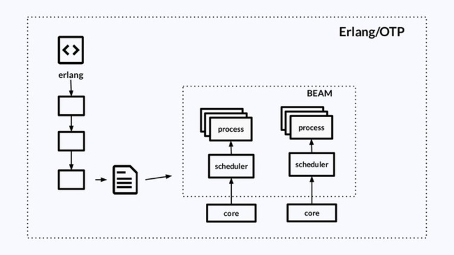

Sobre mim
---


Olá! Eu sou Zoey Pessanha, uma entusiasta de Elixir e engenheira de software com uma paixão ardente pela programação funcional e desenvolvimento web. Meu foco principal é a linguagem Elixir e o framework Phoenix, e estou animada para compartilhar meu conhecimento e experiência com você neste workshop.

## Experiências

<!-- column_layout: [4, 3, 3, 3] -->

<!-- column: 0 -->


<!-- column: 1 -->


<!-- column: 2 -->


<!-- column: 3 -->


<!-- reset_layout -->

## Curiosidades

- gosto de cozinhar
- já disse que adoro programar?
- já vi uns anime estranho (puka, lain)
- adoro viajar e fazer mochilão

[GitHub: @zoedsoupe](https://github.com/zoedsoupe) | [LinkedIn: Zoey Pessanha](https://linkedin.com/in/zoedsoupe)

<!-- end_slide -->

Introdução ao Elixir
---

- lang funcional
- alta concorrência
- tolerante a falhas
- sintaxe amigável
- é executada na máquina virtual do Erlang, a BEAM

## Como a BEAM funciona?

<!-- column_layout: [2, 10, 2] -->
<!-- column: 1 -->


<!-- end_slide -->

Introdução ao Elixir
---

### Supervisors

- controla e gerencia vários processos
- estratégia `:one_for_one`, `:one_for_all`, `:rest_for_one`

```elixir
defmodule MeuApp.Application do
  use Application

  def start_link(_start, _args) do
    children = [App1, App2, App3]
    options = [strategy: :one_for_one]
    Supervisor.star_link(children, opts)
  end
end
```

<!-- end_slide -->

Introdução ao Elixir
---

Todos os exemplos a seguir podem ser testados no REPL do Elixir: `iex`

## Números e Strings

```elixir
1 # inteiros
1.0 # float 64bits
100_000_000 # separador para casa decimais
0b101 # 5 em binário
0o777 # 511 em octal
0x2A # 42 em hexadecimal

"UMA STRING"
'UMA CADEIA DE CARACTERES'
~s(uma string) # mesmo que usar ""
```

## Variável

```elixir
a = 1
```

## Módulos e Funções

```elixir
defmodule Teste do
  def hello do
    IO.puts("Hello World")
  end

  defp private, do: IO.puts("Sou privada!")
end
```

<!-- end_slide -->

Introdução ao Elixir
---

## Listas e Tuplas

```elixir
[1, 2, 3] # lista homogênea
[1, "string", 42] # lista heterogênea
~w(foo bar) # lista de palavras ["foo", "bar"]

{1, 2} # tupla 2 elementos: par
{:ok, 42, "string"} # tupla 3 elementos: tripla
```

## Átomos e Mapas

```elixir
:zoey # átomo que seu valor é ele mesmo
:zoey == :zoey # true
true and false or nil # átomos especial

%{chave: "valor", :1 => 42, "chave" => :valor}
```

<!-- end_slide -->

Phoenix Live View
---

Video sobre Live View: [](./assets/what_is_lvie_view.mp4)

<!-- end_slide -->

Liquid Bank Web
---

Vamos começar pela tela de Login criando um arquivo em `lib/liquid_web/user_login_live.ex`:

```elixir
defmodule LiquidWeb.UserLoginLive do
  use LiquidWeb, :live_view

  def render(assigns) do
    ~H"""
    <div class="flex-center flex-col w-full default-padding">
      <DesignSystem.user_profile size="lg" />

      <Form.render for={@form} id="login_form" action={~p"/login"} phx-update="ignore">
        <Form.input field={@form[:cpf]} id="user_cpf" type="text" label="CPF" required />
        <Form.input field={@form[:password]} type="password" label="Password" required />

        <:actions>
          <.button type="submit" style="primary" size="lg" class="text-lg" phx-disable-with="Acessando...">
            Entrar
          </.button>
        </:actions>

          <.link navigate={~p"/register"} class="text-white text-md">
            Não possui conta? Cadastre-se já!
          </.link>
      </Form.render>
    </div>
    """
  end

  def mount(_params, _session, socket) do
    form = to_form(%{}, as: "user")
    {:ok, assign(socket, form: form), temporary_assigns: [form: form]}
  end
end
```

<!-- end_slide -->

Liquid Bank Web
---

Agora vamos fazer o cadastro de novas contas em `lib/liquid_web/live/user_registration_live.ex`:

Començando pelo render, o HTML que vai ser renderizado:

```elixir
defmodule LiquidWeb.UserRegistrationLive do
  use LiquidWeb, :live_view

  alias Liquid.Accounts
  alias Liquid.Auth
  alias Liquid.Auth.Models.User

  @impl true
  def render(assigns) do
    ~H"""
    <div class="flex-center flex-col w-full default-padding">
      <DesignSystem.user_profile size="lg" />

      <Form.render for={@form} id="registration_form" phx-submit="save" phx-change="validate" phx-trigger-action={@trigger_submit}
        action={~p"/accounts/log_in?_action=registered"}
        method="post"
        class="w-full"
      >
        <Form.error :if={@check_errors}>
          Parece que alguns campos são inválidos, confirme os dados abaixo!
        </Form.error>

        <Form.input field={@form[:cpf]} id="user_cpf" type="text" label="Seu CPF" placeholder="000.000.000-00" class="text-md" required />
        <Form.input field={@form[:first_name]} type="text" label="Primeiro nome" required />
        <Form.input field={@form[:last_name]} type="text" label="Sobrenome" required />
        <Form.input field={@form[:password]} type="password" label="Sua Senha" required />

        <:actions>
          <.button type="submit" size="lg" class="text-lg" phx-disable-with="Criando conta...">Cadastrar Conta</.button>
        </:actions>
      </Form.render>
    </div>
    """
  end
end
```

<!-- end_slide -->

Liquid Bank Web
---

Agora com a função `mount`:

```elixir
# ...
  @impl true
  def mount(_params, _session, socket) do
    changeset = Auth.change_user_registration(%User{})

    socket =
      socket
      |> assign(trigger_submit: false, check_errors: false)
      |> assign_form(changeset)

    {:ok, socket, temporary_assigns: [form: nil]}
  end
# ...
```

<!-- end_slide -->

Liquid Bank Web
---

```elixir
# ...
  def handle_event("save", %{"user" => user_params}, socket) do
    with {:ok, account} <- Accounts.register_account(user_params),
         {:ok, user} <- Auth.fetch_user_by_cpf(account.owner_cpf) do
      changeset = Auth.change_user_registration(user)
      {:noreply, socket |> assign(trigger_submit: true) |> assign_form(changeset)}
    else
      {:error, %Ecto.Changeset{} = changeset} ->
        {:noreply, socket |> assign(check_errors: true) |> assign_form(changeset)}

      {:error, :not_found} ->
        {:noreply, redirect(socket, ~p"/")}
    end
  end

  def handle_event("validate", %{"user" => user_params}, socket) do
    changeset = Auth.change_user_registration(%User{}, user_params)
    {:noreply, assign_form(socket, Map.put(changeset, :action, :validate))}
  end

  defp assign_form(socket, %Ecto.Changeset{} = changeset) do
    form = to_form(changeset, as: "user")

    if changeset.valid? do
      assign(socket, form: form, check_errors: false)
    else
      assign(socket, form: form)
    end
  end
# ...
```

<!-- end_slide -->

Liquid Bank Web
---

E também teremos uma tela para o perfil da pessoa usuária logada em `lib/liquid_web/live/user_profile_live.ex`:

```elixir
defmodule LiquidWeb.UserProfileLive do
  use LiquidWeb, :live_view

  alias Liquid.Accounts
  alias Liquid.Auth
  alias Liquid.Auth.Models.User

  @impl true
  def mount(_params, _session, socket) do
    changeset = Auth.change_user_registration(socket.assigns.current_user, %{}, :update)
    {:ok, socket |> assign(check_errors: false) |> assign_form(changeset) |> assign(trigger_submit: false)}
  end
end
```

<!-- end_slide -->

Liquid Bank Web
---

```elixir
# ...
  @impl true
  def render(assigns) do
    ~H"""
      <div class="flex-center flex-col w-full default-padding">
        <DesignSystem.user_profile size="lg" />

        <Form.render for={@form} id="profile_form" phx-submit="save" phx-change="validate" class="w-full"
        phx-trigger-action={@trigger_submit}
        action={~p"/logout"}
        method="delete"
        >
          <Form.error :if={@check_errors}>
            Parece que alguns campos são inválidos, confirme os dados abaixo!
          </Form.error>

          <Form.input field={@form[:cpf]} id="user_cpf" type="text" label="Seu CPF" placeholder="000.000.000-00" class="text-md" disabled />
          <Form.input field={@form[:first_name]} type="text" label="Primeiro nome" />
          <Form.input field={@form[:last_name]} type="text" label="Sobrenome" />
          <Form.input field={@form[:password]} type="password" label="Sua Senha" />

          <:actions>
            <.button type="submit" size="lg" class="text-lg" phx-disable-with="Atualizando conta...">Atualizar Conta</.button>
          </:actions>
          <.button phx-click="logout" size="lg" style="secondary" class="text-lg">Desconectar</.button>
        </Form.render>
      </div>
    """
  end
# ...
```

<!-- end_slide -->

Liquid Bank Web
---

```elixir
# ...
  @impl true
  def handle_event("logout", _, socket) do
    {:noreply, assign(socket, trigger_submit: true)}
  end

  def handle_event("save", %{"user" => user_params}, socket) do
    account = socket.assigns.current_user.bank_account

    with {:ok, account} <- Accounts.update_bank_account(account, user_params),
         {:ok, user} <- Auth.fetch_user_by_cpf(account.owner_cpf) do
      changeset = Auth.change_user_registration(user, %{}, :update)
      {:noreply, assign_form(socket, changeset)}
    else
      {:error, %Ecto.Changeset{} = changeset} ->
        {:noreply,
         socket
         |> assign(check_errors: true)
         |> assign_form(changeset)}
    end
  end

  def handle_event("validate", %{"user" => user_params}, socket) do
    changeset = Auth.change_user_registration(%User{}, user_params, :update)
    {:noreply, assign_form(socket, Map.put(changeset, :action, :validate))}
  end

  defp assign_form(socket, %Ecto.Changeset{} = changeset) do
    form = to_form(changeset, as: "user")

    if changeset.valid? do
      assign(socket, form: form, check_errors: false)
    else
      assign(socket, form: form)
    end
  end
# ...
```

<!-- end_slide -->

Liquid Bank Web
---

Agora a tela de dashboard `lib/liquid_web/live/dashboard_live.ex`:

```elixir
defmodule LiquidWeb.DashboardLive do
  use LiquidWeb, :live_view

  alias LiquidWeb.DesignSystem.Dashboard

  def render(assigns) do
    ~H"""
    	<div style="gap: 2.5rem;" class="flex-center flex-col w-full">
    		<Dashboard.navbar user_name={@current_user.first_name} />
        <Dashboard.balance amount={@current_user.bank_account.balance} />
        <Dashboard.actions />
        <Dashboard.call_to_action />
    	</div>
    """
  end
end
```

<!-- end_slide -->

Liquid Bank Web
---

Para criar uma nova transação, vamos criar `lib/liquid_web/live/new_transaction_live.ex`:

```elixir
defmodule LiquidWeb.NewTransactionLive do
  use LiquidWeb, :live_view

  alias Liquid.Accounts
  alias LiquidWeb.DesignSystem.Transaction

  @impl true
  def mount(_params, _session, socket) do
    accounts = Accounts.list_bank_account()
    {:ok, assign(socket, accounts: accounts)}
  end

  @impl true
  def render(assigns) do
    ~H"""
      <div class="flex-center flex-col w-full" style="gap: 2rem;">
        <Transaction.navbar />
        <Transaction.search_input />
        <Transaction.contact_list accounts={@accounts} />
      </div>
    """
  end

  @impl true
  def handle_event("transfer-to", %{"id" => identifier}, socket) do
    account = Enum.find(socket.assigns.accounts, &(&1.identifier == identifier))

    {:noreply, push_navigate(socket, to: ~p"/app/transactions/review/#{account.identifier}")}
  end

  def handle_event("search", %{"value" => ""}, socket) do
    accounts = Accounts.list_bank_account()
    {:noreply, assign(socket, accounts: accounts)}
  end

  def handle_event("search", %{"value" => name}, socket) do
    accounts =
      Enum.filter(socket.assigns.accounts, fn account ->
        String.downcase(account.owner_name) =~ String.downcase(name)
      end)

    {:noreply, assign(socket, accounts: accounts)}
  end
end
```

<!-- end_slide -->

Liquid Bank Web
---

Após selecionar a conta para enviar transferência, é preciso revisar a transferência e definir um valor, em `lib/liquid_web/live/review_transaction_live.ex`:

```elixir
defmodule LiquidWeb.ReviewTransactionLive do
  use LiquidWeb, :live_view

  alias Liquid.Accounts
  alias Liquid.Operations
  alias Liquid.Operations.Schemas.NewTransaction
  alias LiquidWeb.DesignSystem.Transaction

  @impl true
  def mount(%{"id" => account_id}, _session, socket) do
    {:ok, account} = Accounts.fetch_bank_account(account_id, :schema)
    current_account = socket.assigns.current_user.bank_account

    changeset =
      NewTransaction.changeset(
        %NewTransaction{},
        %{sender_id: current_account.id, receiver_id: account.identifier},
        current_account.balance
      )

    {:ok,
     socket
     |> assign(trigger_submit: false)
     |> assign(account: account)
     |> assign(form: changeset)
     |> assign(show_modal: false)}
  end
end
```

<!-- end_slide -->

Liquid Bank Web
---

```elixir
# ...
  @impl true
  def render(assigns) do
    ~H"""
    	<div class="flex-col flex-center w-full" style="gap: 2rem; position: relative;">
        <Transaction.navbar />
    		<Transaction.profile_summary account={@account} />
        <Transaction.profile_info account={@account} />
        <Transaction.action_buttons />
        <Transaction.transaction_modal :if={@show_modal} form={@form} balance={@current_user.bank_account.balance} trigger_submit={@trigger_submit} />
     	</div>
    """
  end
# ...
```

<!-- end_slide -->

Liquid Bank Web
---

```elixir
# ...
  @impl true
  def handle_event("cancel", _, socket) do
    {:noreply, redirect(socket, to: ~p"/app/dashboard")}
  end

  def handle_event("confirm", _, socket) do
    {:noreply,
     socket
     |> assign(show_modal: true)
     |> push_event("mask-input", %{})}
  end

  defp to_integer(""), do: 0

  defp to_integer(amount) do
    amount
    |> Money.parse!(:BRL)
    |> Money.to_decimal()
    |> Decimal.to_integer()
  end

  defp assign_form(socket, %Ecto.Changeset{} = changeset) do
    form = to_form(changeset)

    if changeset.valid? do
      assign(socket, form: form, check_errors: false)
    else
      assign(socket, form: form)
    end
  end
# ...
```

<!-- end_slide -->

Liquid Bank Web
---

```elixir
# ...
  def handle_event("validate", %{"new_transaction" => %{"amount" => amount}}, socket) do
    amount = to_integer(amount)
    balance = socket.assigns.current_user.bank_account.balance
    sender = socket.assigns.current_user.bank_account
    receiver = socket.assigns.account
    params = %{sender_id: sender.id, receiver_id: receiver.identifier, amount: amount}
    changeset = NewTransaction.changeset(params, balance)
    {:noreply, assign_form(socket, Map.put(changeset, :action, :validate))}
  end
# ...
```

<!-- end_slide -->

Liquid Bank Web
---

```elixir
# ...
  def handle_event("transfer", %{"new_transaction" => %{"amount" => amount}}, socket) do
    amount = to_integer(amount)
    sender = socket.assigns.current_user.bank_account
    receiver = socket.assigns.account
    params = %{sender_id: sender.id, receiver_id: receiver.identifier, amount: amount}

    with %Ecto.Changeset{valid?: true} = changeset <-
           NewTransaction.changeset(params, sender.balance),
         {:ok, _} <- Operations.schedule_new_transaction(params, sender) do
      {:noreply,
       socket
       |> assign(trigger_submit: true)
       |> assign_form(changeset)
       |> redirect(to: ~p"/app/extrato")}
    else
      %Ecto.Changeset{valid?: false} = changeset ->
        {:noreply, assign_form(socket, Map.put(changeset, :action, :validate))}
    end
  end
# ...
```

<!-- end_slide -->

Liquid Bank Web
---

Agora que conseguimos fazer transferências, vamos criar uma página de detalhes para cada transação em `lib/liquid_web/live/transaction_summary_live.ex`:

```elixir
defmodule LiquidWeb.TransactionSummaryLive do
  use LiquidWeb, :live_view

  alias Liquid.Accounts
  alias Liquid.Operations
  alias LiquidWeb.DesignSystem.Transaction

  @impl true
  def mount(%{"id" => transaction_id}, _session, socket) do
    {:ok, transaction} = Operations.fetch_transaction(transaction_id)
    account_id = socket.assigns.current_user.bank_account.id
    {:ok, current_account} = Accounts.fetch_bank_account(account_id, :schema)
    {:ok, assign(socket, transaction: transaction, current_account: current_account)}
  end

  @impl true
  def render(assigns) do
    ~H"""
     <div class="flex-center flex-col w-full" style="position: relative;">
    	<Transaction.close_summary />
      <Transaction.hero />
      <Transaction.badge type={@transaction.type} status={@transaction.status} />
      <Transaction.transaction_summary transaction={@transaction} current_account={@current_account} />
      <Transaction.cancel_at :if={@transaction.processed_at} processed_at={@transaction.processed_at} />
    </div>
    """
  end
end
```

<!-- end_slide -->

Liquid Bank Web
---

```elixir
# ...
  @impl true
  def handle_event("transact-again", _, socket) do
    transaction = socket.assigns.transaction
    current_account = socket.assigns.current_account
    {:ok, account} = Accounts.fetch_bank_account(current_account.identifier)

    params = %{
      sender_id: transaction.sender_id,
      receiver_id: transaction.receiver_id,
      amount: transaction.amount
    }

    {:ok, _} = Operations.schedule_new_transaction(params, account)
    {:noreply, redirect(socket, to: ~p"/app/extrato")}
  end

  def handle_event("trigger-chargeback", _, socket) do
    transaction = socket.assigns.transaction
    :ok = Operations.schedule_transaction_chargeback(transaction.id)
    {:noreply, redirect(socket, to: ~p"/app/extrato")}
  end
# ...
```

<!-- end_slide -->

Liquid Bank Web
---

Por fim vamos construir a página de extrato `lib/liquid_web/live/extrato_live.ex`:

```elixir
defmodule LiquidWeb.ExtratoLive do
  use LiquidWeb, :live_view

  alias Liquid.Operations

  alias LiquidWeb.DesignSystem.Dashboard
  alias LiquidWeb.DesignSystem.Extrato

  @impl true
  def mount(_params, _session, socket) do
    account = socket.assigns.current_user.bank_account
    transactions = Operations.list_transactions_by_processed_at(account.id)
    {:ok, assign(socket, transactions: transactions, current_tab: "all")}
  end

  @impl true
  def render(assigns) do
    ~H"""
     <div class="flex-center flex-col w-full" style="gap: 1.75rem;">
       <Extrato.navbar />
       <Dashboard.balance amount={@current_user.bank_account.balance} />
       <Extrato.tabs current={@current_tab} />
       <Extrato.receipt transactions={@transactions} />
     </div>
    """
  end
end
```

<!-- end_slide -->

Liquid Bank Web
---

```elixir
# ...
  @impl true
  def handle_event("trigger-summary", %{"transaction-id" => transaction_id}, socket) do
    {:noreply, push_navigate(socket, to: ~p"/app/transactions/#{transaction_id}")}
  end

  def handle_event("filter-by", %{"filter" => filter}, socket) do
    account = socket.assigns.current_user.bank_account

    case filter do
      "income" ->
        transactions =
          account.id
          |> Operations.list_transactions_by_processed_at()
          |> Enum.map(&filter_by(&1, "income"))

        {:noreply, assign(socket, transactions: transactions, current_tab: "income")}

      "expense" ->
        transactions =
          account.id
          |> Operations.list_transactions_by_processed_at()
          |> Enum.map(&filter_by(&1, "expense"))

        {:noreply, assign(socket, transactions: transactions, current_tab: "expense")}

      _ ->
        transactions = Operations.list_transactions_by_processed_at(account.id)
        {:noreply, assign(socket, transactions: transactions, current_tab: "all")}
    end
  end

  defp filter_by({processed_at, transactions}, type) do
    {processed_at, Enum.filter(transactions, &(&1.type == type))}
  end
# ...
```
